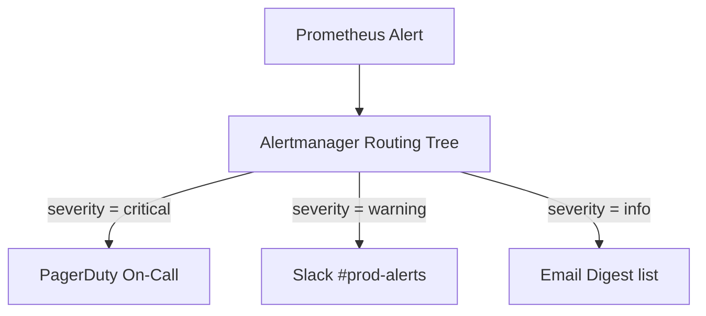
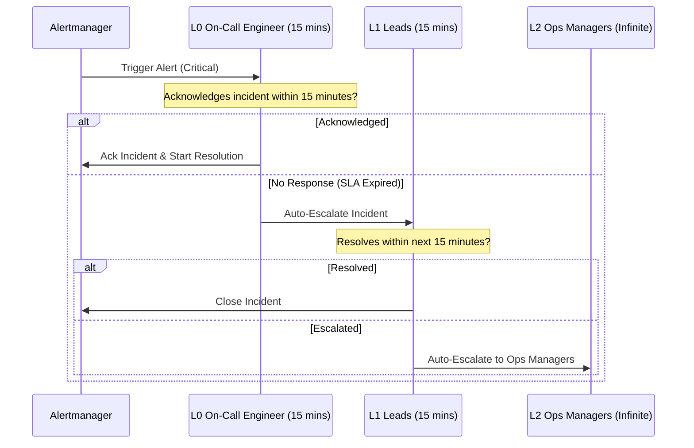

# App Monitoring Alerting Rules & Process


## Document Details

| Author | Created | Version | Last Updated By | Last Edited On | L0 Reviewer | L1 Reviewer | L2 Reviewer |
|--------|---------|---------|-----------------|----------------|-------------|-------------|-------------|
| Bhawna Dangarh | 2026-08-11 | 1.0 | Bhawna Dangarh | 2026-08-11 | Sharvari Khamkar / Tina Bhatnagar | Aman Raj | Abhishek Dubey |

---

# Table of Contents

1. [Introduction](#1-introduction)
2. [Alerting Rules (Prometheus Syntax)](#2-alerting-rules-prometheus-syntax)
3. [Severity Levels](#3-severity-levels)
4. [Notification Channels & Routing](#4-notification-channels--routing)
5. [Incident Escalation Process](#5-incident-escalation-process)
6. [Conclusion](#6-conclusion)
7. [Contact Information](#7-contact-information)
8. [References](#8-references)

---

# 1. Introduction

For application monitoring (such as the **OTMS microservices**), detecting anomalies proactively is key to preserving system availability. This document outlines the alerting rules, severity classifications, routing channels, and escalation procedures configured using Prometheus and Alertmanager.

---

# 2. Alerting Rules (Prometheus Syntax)

These rules monitor application status, error rates, and response latencies:

### A. Application Down Alert
Triggers when an application service instance goes offline.
```yaml
groups:
  - name: application-health
    rules:
      - alert: AppInstanceDown
        expr: up{job="otms-services"} == 0
        for: 2m
        labels:
          severity: critical
        annotations:
          summary: "Application instance {{ $labels.instance }} down"
          description: "Service {{ $labels.job }} is offline for more than 2 minutes."
```

### B. High HTTP 5xx Error Rate
Triggers when HTTP 5xx error responses exceed 5% of total requests over a 5-minute window.
```yaml
      - alert: HighHttp5xxErrorRate
        expr: sum(rate(http_requests_total{status=~"5.."}[5m])) / sum(rate(http_requests_total[5m])) * 100 > 5
        for: 3m
        labels:
          severity: warning
        annotations:
          summary: "High HTTP 5xx Error Rate detected"
          description: "HTTP 5xx error rate is {{ $value | printf \"%.2f\" }}% on application service."
```

### C. Slow HTTP Response Latency
Triggers when the 95th percentile response latency exceeds 2 seconds.
```yaml
      - alert: SlowHttpResponseLatency
        expr: histogram_quantile(0.95, sum(rate(http_request_duration_seconds_bucket[5m])) by (le)) > 2
        for: 5m
        labels:
          severity: warning
        annotations:
          summary: "Slow Response Latency (p95 > 2s)"
          description: "p95 HTTP response duration is {{ $value }}s over the last 5 minutes."
```

---

# 3. Severity Levels

We classify alerts into three distinct severity tiers to prevent alert fatigue:

| Severity | Definition | Action Timeline | Example Incident |
| :--- | :--- | :--- | :--- |
| **Critical** | Production system is down or severely degraded. Core user features are non-functional. | Immediate action (PagerDuty trigger, 15-minute response SLA). | `AppInstanceDown` (0 instances running), database connection failure. |
| **Warning** | System is experiencing high error rates or resource pressure, but still functional. | Business hours investigation (within 4 hours). | `HighHttp5xxErrorRate` (exceeding 5% rate limit), high CPU usage. |
| **Info** | Configuration anomalies or non-critical state warnings. | Review during routine checks (no active page). | SSL certificate expiring in 30 days. |

---

# 4. Notification Channels & Routing

Prometheus Alertmanager routes alerts dynamically based on labels:



### Alertmanager Routing Configuration Snippet:
```yaml
route:
  group_by: ['alertname', 'cluster', 'service']
  group_wait: 30s
  group_interval: 5m
  repeat_interval: 12h
  receiver: 'slack-warnings'
  routes:
    - match:
        severity: critical
      receiver: 'pagerduty-critical'
    - match:
        severity: warning
      receiver: 'slack-warnings'

receivers:
- name: 'slack-warnings'
  slack_configs:
  - channel: '#prod-alerts'
    api_url: 'https://hooks.slack.com/services/T00/B00/X00'
- name: 'pagerduty-critical'
  pagerduty_configs:
  - service_key: 'pd-service-routing-key-example'
```

---

# 5. Incident Escalation Process

To ensure incidents are resolved, PagerDuty implements an automated escalation policy:



### Escalation Path Details:
1. **L0 Support (Primary On-Call)**: Has **15 minutes** to acknowledge the PagerDuty alert.
2. **L1 Support (Lead Engineers)**: If L0 does not respond, the alert escalates to L1, who has another **15 minutes** to coordinate resolution.
3. **L2 Management (Ops Managers)**: If still unresolved or unacknowledged, notifications are escalated to the operations management tier.

---

# 6. Conclusion

By establishing standardized alert definitions, routing criteria, and escalation chains, the team ensures high application reliability while protecting engineers from alert fatigue.

---

# 7. Contact Information

| Name | Email | Role |
|------|-------|------|
| Bhawna Dangarh | bhawna.dangarh.snaatak@mygurukulam.co | DevOps Engineer |

---

# 8. References

| Source | Description |
|--------|-------------|
| Prometheus Alerting Rules | https://prometheus.io/docs/prometheus/latest/configuration/alerting_rules/ |
| Alertmanager Configuration | https://prometheus.io/docs/alerting/latest/configuration/ |
