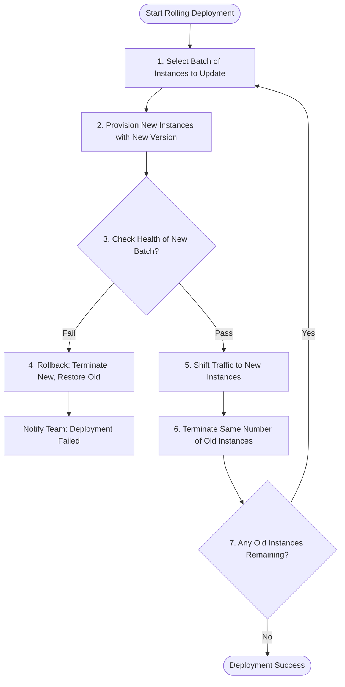

# Deployment Strategies

---

## Author Information

| Author         | Created    | Version | Last Updated By | Last Edited On | L0 Reviewer                       | L1 Reviewer | L2 Reviewer    |
| -------------- | ---------- | ------- | --------------- | -------------- | --------------------------------- | ----------- | -------------- |
| Bhawna Dangarh | 2026-08-11 | 1.3     | Bhawna Dangarh  | 2026-08-11     | Sharvari Khamkar / Tina Bhatnagar | Aman Raj    | Abhishek Dubey |

---

1. [Introduction](#1-introduction)
2. [Objective](#2-objective)
3. [Deployment Strategies Explained](#3-deployment-strategies-explained)  
   3.1 [Recreate Deployment](#31-recreate-deployment)  
   3.2 [Blue-Green Deployment](#32-blue-green-deployment)  
   3.3 [Canary Deployment](#33-canary-deployment)  
   3.4 [Shadow (A/B) Deployment](#34-shadow-ab-deployment)  
4. [Rolling Deployment – Detailed Strategy](#4-rolling-deployment-detailed-strategy)  
   4.1 [Rolling Deployment Flowchart](#41-rolling-deployment-flowchart)  
   4.2 [How It Works (Workflow & Steps)](#42-how-it-works-workflow--steps)  
   4.3 [Benefits](#43-benefits)  
   4.4 [Risks & Mitigations](#44-risks--mitigations)  
   4.5 [Suitable Use Cases](#45-suitable-use-cases)  
5. [Frequently Asked Questions (FAQs)](#5-frequently-asked-questions-faqs)
6. [Contact Information](#6-contact-information)
7. [References](#7-references)

---

## 1. Introduction

Continuous Delivery (CD) relies on deployment strategies to release software updates to production environments safely, predictably, and with minimal interruption. Choosing the right release mechanism depends on factors such as application architecture (stateful vs. stateless), budget, resource constraints, and risk tolerance. This document serves as a Proof of Concept (POC) detailing the different deployment strategies and focusing specifically on the **Rolling Deployment** strategy as the primary rollout mechanism.

---

## 2. Objective

* Introduce and explain all industry-standard deployment strategies (Recreate, Blue-Green, Canary, and Shadow/A-B).
* Provide a detailed architectural guide on the **Rolling Deployment** strategy including its steps, benefits, risks, and suitable use cases.
* Outline standard command lines and troubleshooting checklists for managing rollouts without needing complex Kubernetes configurations.

---

## 3. Deployment Strategies Explained

### 3.1 Recreate Deployment

In a **Recreate** deployment, all running instances of the active version are terminated before the new version is launched. This is simple to configure and eliminates version skew, but it introduces direct downtime during the transition phase while new containers start up.

### 3.2 Blue-Green Deployment

In a **Blue-Green** deployment, two identical production-ready environments are maintained. The new release is deployed to the inactive environment (Green) and fully verified, after which traffic routing is switched instantly. This ensures zero downtime and instant rollback, but requires double the computing resources.

### 3.3 Canary Deployment

In a **Canary** deployment, updates are deployed to a tiny subset of the production cluster (e.g. 5-10% of nodes). A small percentage of live users are routed to this canary release to gather telemetry metrics. If stable, the release is gradually rolled out to the rest of the fleet, minimizing the blast radius of any undetected bugs.

### 3.4 Shadow (A/B) Deployment

In a **Shadow (A/B)** deployment, the new version is deployed alongside the active version. Production traffic is cloned and sent to both versions, but only the active version's response is returned to the user. This allows testing with real production load without risking user impact, though it is highly complex to configure.

---

## 4. Rolling Deployment Detailed Strategy

A **Rolling Deployment** replaces running application instances incrementally, scaling up a batch of new instances while scaling down old ones. This prevents service-wide downtime.

### 4.1 Rolling Deployment Flowchart

### 4.2 How It Works (Workflow & Steps)

1. **Batch Sizing**: Configure parameters like `max_surge` (extra instances launched) and `max_unavailable` (how many old nodes can be deleted at once). For example, a 25% batch size on a 4-node cluster updates 1 node at a time.

2. **Launch New Instances**: The orchestrator triggers new instances with the updated package or container image.

3. **Health Validation**: The system waits for health checks (`/health` endpoint) on port `8080/8081` to return `200 OK` responses before marking the new instances as active.

4. **Traffic Redirect**: The load balancer redirects user traffic to the active, validated new nodes.

5. **Decommission Old Nodes**: The corresponding number of old version nodes are terminated.

6. **Iterate**: The system repeats the loop until 100% of the active nodes are running the new release version.

### 4.3 Benefits

| Benefit              | Description                                                                                                                |
| :------------------- | :------------------------------------------------------------------------------------------------------------------------- |
| **Zero Downtime**    | Active nodes are always present to serve user requests, ensuring uninterrupted customer access.                            |
| **Low Overhead**     | Requires only a small resource buffer (the batch size) during the update, making it cost-efficient compared to Blue-Green. |
| **Fail-Fast Safety** | Problems in the new version are caught during the first batch update, limiting blast radius.                               |
| **Easy Monitoring**  | Each new batch can be checked using health checks and application metrics before continuing.                               |
| **Gradual Release**  | The new version is introduced step by step, making the deployment easier to control.                                       |

### 4.4 Risks & Mitigations

* **Version Skew:** Two versions run concurrently, which can cause session bugs or database schema conflicts.
  **Mitigation:** Ensure APIs are backward and forward-compatible; use sticky sessions on load balancers; write database migrations using the expand-contract pattern.

* **Slow Rollout:** Large host groups take a long time to upgrade.
  **Mitigation:** Adjust batch size percentages (e.g. update 50% of instances concurrently instead of 10%).

* **State/Session Loss:** Active user sessions on terminated hosts get dropped.
  **Mitigation:** Externalize state using Redis session stores.

### 4.5 Suitable Use Cases

| Recommended Use Case                  | Scenario & Criteria                                                                                                                                | Examples                                |
| :------------------------------------ | :------------------------------------------------------------------------------------------------------------------------------------------------- | :-------------------------------------- |
| **Stateless Microservices**           | Ideal for web APIs and microservices where multiple minor versions can run concurrently without session loss or database schema mismatches.        | React Frontends, Salary/Attendance APIs |
| **High-Availability APIs**            | Crucial for backend APIs serving critical endpoints where zero-downtime is a hard requirement.                                                     | Production APIs                         |
| **Resource-Constrained Environments** | Best for small environments or environments with tight budgets where running duplicate parallel infrastructure (like Blue-Green) is too expensive. | Small AWS environments                  |
| **Small, Frequent Updates**           | Well-suited for high-frequency continuous integration pipelines deploying minor code fixes or feature updates incrementally.                       | CI/CD applications                      |

---

## 5. Frequently Asked Questions (FAQs)

| Question                                                      | Answer / Explanation                                                                                                                                                                  |
| :------------------------------------------------------------ | :------------------------------------------------------------------------------------------------------------------------------------------------------------------------------------ |
| **Q1: Which deployment strategy is the most cost-effective?** | **Recreate** requires zero extra resources. **Rolling** is also cost-effective, needing only a small temporary surge buffer, while **Blue-Green** requires additional infrastructure. |
| **Q2: How does Rolling Deployment prevent downtime?**         | It replaces instances incrementally in small batches while healthy instances continue serving traffic.                                                                                |
| **Q3: What is the main risk of Rolling Updates?**             | **Version skew**, where old and new versions run concurrently and may cause compatibility issues.                                                                                     |
| **Q4: When should we choose Canary instead of Rolling?**      | Choose **Canary** for high-risk or major updates that need testing with a small percentage of live users first.                                                                       |
| **Q5: Can we rollback a Rolling Deployment instantly?**       | No. The previous version usually needs to be deployed again across the nodes batch-by-batch.                                                                                          |
---

## 6. Contact Information

| Name           | Email                                                                                 |
| -------------- | ------------------------------------------------------------------------------------- |
| Bhawna Dangarh | [bhawna.dangarh.snaatak@mygurukulam.co](mailto:bhawna.dangarh.snaatak@mygurukulam.co) |

---

## 7. References

| Source                             | Description                                      | Link                                                                                                         |
| ---------------------------------- | ------------------------------------------------ | ------------------------------------------------------------------------------------------------------------ |
| AWS ASG Instance Refresh           | AWS guide on performing rolling instance updates | [AWS Documentation](https://docs.aws.amazon.com/autoscaling/ec2/userguide/asg-instance-refresh.html)         |
| Cloud-Native Deployment Strategies | CNCF guide on modern cloud deployment patterns   | [CNCF Blog](https://www.cncf.io/blog/2022/10/24/kubernetes-deployment-strategies-rolling-blue-green-canary/) |
