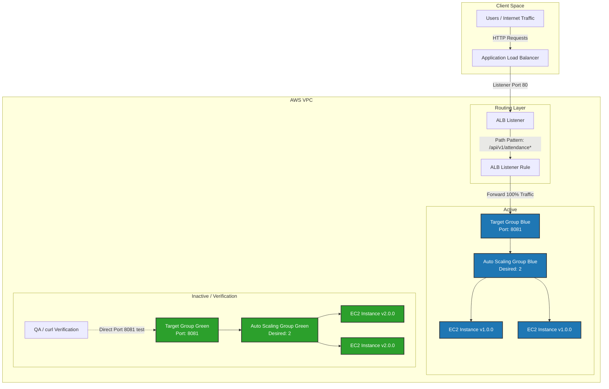
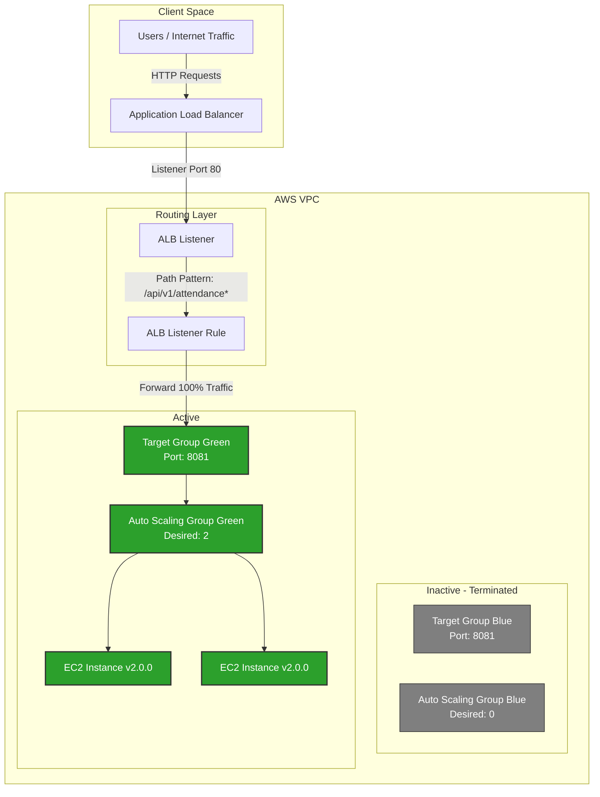
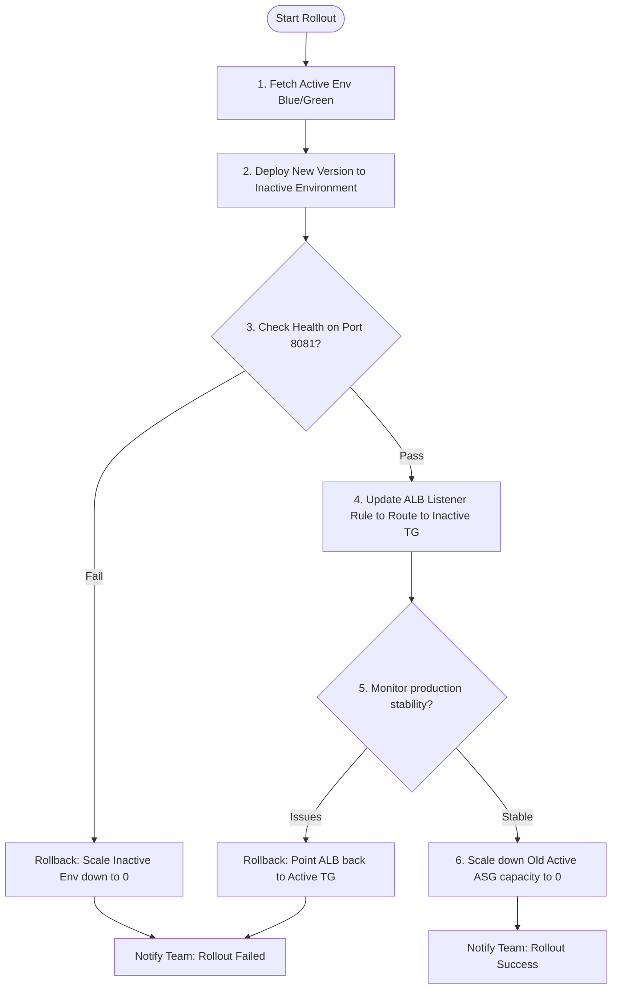

# POC – Continuous Delivery via Blue-Green Deployment

---

## Author Information

| Author | Created | Version | Last Updated By | Last Edited On | L0 Reviewer | L1 Reviewer | L2 Reviewer |
|---|---|---|---|---|---|---|---|
| Bhawna Dangarh | 2026-08-09 | 1.3 | Bhawna Dangarh | 2026-08-13 | Sharvari Khamkar / Tina Bhatnagar | Aman Raj | Abhishek Dubey |

---

## Table of Contents

1. [Introduction](#1-introduction)
2. [Objective](#2-objective)
3. [Blue-Green Architecture & Traffic Flow](#3-blue-green-architecture--traffic-flow)
4. [Blue-Green Infrastructure Flowchart](#4-blue-green-infrastructure-flowchart)
5. [Step-by-Step Implementation (Resource Lifecycle)](#5-step-by-step-implementation-resource-lifecycle)  
   5.1 [Stage 1: Provision Initial Active Environment (Blue Only)](#51-stage-1-provision-initial-active-environment-blue-only)  
   5.2 [Stage 2: Introduce and Provision the Green Environment](#52-stage-2-introduce-and-provision-the-green-environment)  
   5.3 [Stage 3: Health Status Check Verification](#53-stage-3-health-status-check-verification)  
   5.4 [Stage 4: Shift Traffic to Green (Update Listener Rule)](#54-stage-4-shift-traffic-to-green-update-listener-rule)  
   5.5 [Stage 5: Scale Down Blue Environment](#55-stage-5-scale-down-blue-environment)  
6. [Commands Used](#6-commands-used)
7. [Troubleshooting](#7-troubleshooting)
8. [Contact Information](#8-contact-information)
9. [References](#9-references)
10. [Complete Terraform Configuration Files](#10-complete-terraform-configuration-files)

---

## 1. Introduction

Continuous Delivery (CD) is used to deploy application releases automatically, safely, and reliably. Rather than updating live EC2 instances in-place (Mutable Infrastructure)—which risks configuration drift and downtime—we employ **Blue-Green Deployment** (Immutable Infrastructure). 

In this setup, we maintain two identical production-ready environments:
- **Blue**: Represents the current active production environment.
- **Green**: Represents the inactive environment where the new version is deployed and verified before shifting traffic.

If an issue occurs, rollback is instantaneous, achieved by pointing the load balancer rule back to the healthy Blue environment.

---

## 2. Objective

- Automate zero-downtime application deployments.
- Build infrastructure configurations using Terraform to control target groups, Auto Scaling Groups (ASGs), and Application Load Balancer (ALB) routing rules.
- Demonstrate a complete, self-healing CD rollout using an automated shell script wrapper.
- Configure health checks to guarantee that unhealthy application versions do not receive user traffic.
- Reduce resource costs by scaling down the inactive environment's capacity to zero after a successful rollout.

---

## 3. Blue-Green Architecture & Traffic Flow

The following diagrams illustrate the static AWS resource configuration and how traffic is shifted during a rollout:

### Phase 1: Deploy & Verify (Blue Environment Active, Green Deploying)
* **Blue ASG** is active and serving 100% of production traffic through the **Blue Target Group**.
* **Green ASG** is scaled up with the new version and registered with the **Green Target Group** for health check verification and testing.



### Phase 2: Traffic Shift & Clean-up (Green Environment Active, Blue Scaled Down)
* The **ALB Listener Rule** is updated to point to the **Green Target Group**, routing 100% of production traffic to the new version.
* Once the Green environment is verified as stable in production, the **Blue ASG** is scaled down to `0` capacity to release resources.



---

## 4. Blue-Green Infrastructure Flowchart

The flowchart below demonstrates the rollout steps and rollback checkpoints implemented in this POC:



---

## 5. Step-by-Step Implementation (Resource Lifecycle)

> [!NOTE]
> **Static Infrastructure Strategy (No Modules):** 
> To keep the configuration simple, highly auditable, and transparent, this implementation uses static Terraform resource definitions (ASGs, Target Groups, and Listener Rules) directly. We avoid complex Terraform modules. The resource lifecycle (creating the new environment, verifying it, routing traffic, and decommissioning the old environment) is driven step-by-step by modifying the static Terraform files directly.

### 5.1 Stage 1: Provision Initial Active Environment (Blue Only)

Initially, only the Blue environment resources are declared and deployed. The Application Load Balancer routes 100% of production traffic to this environment.

At this stage, `main.tf` contains:
* Data source lookups (VPC, Subnets, Security Group, ALB).
* Target Group: `tg_blue` (runs on port 8081).
* Launch Template & ASG: `lt_blue` and `asg_blue`.
* ALB Listener Rule pointing directly to `tg_blue.arn`.

```hcl
# main.tf (Initial State)

# 1. Network & Resource Lookups
data "aws_vpc" "main" {
  tags = { Name = "${var.environment}-otms-vpc" }
}
data "aws_subnet" "backend" {
  tags = { Name = "${var.environment}_otms_backend_subnet_a" }
}
data "aws_security_group" "attendance" {
  tags = { Name = "${var.environment}-otms-attendance-sg" }
}
data "aws_lb" "otms_alb" {
  name = "${var.environment}-otms-alb"
}
data "aws_lb_listener" "otms_http" {
  load_balancer_arn = data.aws_lb.otms_alb.arn
  port              = 80
}

# 2. Target Group Blue
resource "aws_lb_target_group" "tg_blue" {
  name     = "tg-otms-attendance-blue"
  port     = 8081
  protocol = "HTTP"
  vpc_id   = data.aws_vpc.main.id

  health_check {
    path                = "/api/v1/attendance/health"
    port                = "8081"
    protocol            = "HTTP"
    matcher             = "200-399"
    interval            = 15
    timeout             = 5
    healthy_threshold   = 2
    unhealthy_threshold = 3
  }
}

# 3. Blue Launch Template & ASG
resource "aws_launch_template" "lt_blue" {
  name          = "${var.environment}-otms-attendance-lt-blue"
  image_id      = var.ami_id
  instance_type = var.instance_type
  key_name      = var.key_name
  vpc_security_group_ids = [data.aws_security_group.attendance.id]
}

resource "aws_autoscaling_group" "asg_blue" {
  name                = "${var.environment}-otms-attendance-asg-blue"
  vpc_zone_identifier = [data.aws_subnet.backend.id]
  target_group_arns   = [aws_lb_target_group.tg_blue.arn]
  min_size            = 0
  max_size            = 5
  desired_capacity    = var.blue_desired_capacity
  launch_template {
    id      = aws_launch_template.lt_blue.id
    version = "$Latest"
  }
}

# 4. ALB Listener Routing Rule (Points to Blue Target Group)
resource "aws_lb_listener_rule" "attendance" {
  listener_arn = data.aws_lb_listener.otms_http.arn
  priority     = var.rule_priority

  action {
    type             = "forward"
    target_group_arn = aws_lb_target_group.tg_blue.arn
    order            = 2
  }

  condition {
    path_pattern {
      values = ["/api/v1/attendance*"]
    }
  }
}
```

Initialize and deploy the initial active state:
```bash
terraform -chdir=terraform init
terraform -chdir=terraform apply -auto-approve
```

---

### 5.2 Stage 2: Introduce and Provision the Green Environment

When a new version (e.g. `v2.0.0`) is ready, we edit `main.tf` to define the Green Target Group and Green ASG resources. 

> [!IMPORTANT]
> At this stage, **the listener rule resource `aws_lb_listener_rule.attendance` remains pointing to `tg_blue.arn`**. This guarantees that all production client traffic continues to route to the healthy Blue environment while the Green environment is being provisioned.

We append the following resource block declarations to `main.tf`:

```hcl
# 5. Target Group Green (Added to main.tf)
resource "aws_lb_target_group" "tg_green" {
  name     = "tg-otms-attendance-green"
  port     = 8081
  protocol = "HTTP"
  vpc_id   = data.aws_vpc.main.id

  health_check {
    path                = "/api/v1/attendance/health"
    port                = "8081"
    protocol            = "HTTP"
    matcher             = "200-399"
    interval            = 15
    timeout             = 5
    healthy_threshold   = 2
    unhealthy_threshold = 3
  }
}

# 6. Green Launch Template & ASG (Added to main.tf)
resource "aws_launch_template" "lt_green" {
  name          = "${var.environment}-otms-attendance-lt-green"
  image_id      = var.ami_id
  instance_type = var.instance_type
  key_name      = var.key_name
  vpc_security_group_ids = [data.aws_security_group.attendance.id]
}

resource "aws_autoscaling_group" "asg_green" {
  name                = "${var.environment}-otms-attendance-asg-green"
  vpc_zone_identifier = [data.aws_subnet.backend.id]
  target_group_arns   = [aws_lb_target_group.tg_green.arn]
  min_size            = 0
  max_size            = 5
  desired_capacity    = var.green_desired_capacity
  launch_template {
    id      = aws_launch_template.lt_green.id
    version = "$Latest"
  }
}
```

Run `terraform apply` to provision the new Green environment running `v2.0.0`:
```bash
terraform -chdir=terraform apply \
  -var="green_desired_capacity=2" \
  -var="green_app_version=v2.0.0" \
  -auto-approve
```

---

### 5.3 Stage 3: Health Status Check Verification

The newly spawned Green instances are registered with the Green Target Group (`tg_green`) on port `8081`. Before routing any production traffic, we verify that the Green instances pass their health checks:
1. The ALB sends health check requests to `/api/v1/attendance/health` on port `8081` for the Green instances.
2. We verify the health status (must show `healthy` in AWS Target Group Console or CLI).

If the health status checks are **positive** (healthy), we proceed to Stage 4 to switch traffic.
If they **fail**, we rollback by scaling the Green environment capacity back to `0`:
```bash
terraform -chdir=terraform apply \
  -var="green_desired_capacity=0" \
  -auto-approve
```

---

### 5.4 Stage 4: Shift Traffic to Green (Update Listener Rule)

Once the Green instances are confirmed healthy, we shift production traffic. We edit `main.tf` to update the `aws_lb_listener_rule.attendance` resource block, **removing the Blue Target Group reference and replacing it with the Green Target Group**:

```hcl
# main.tf update: Shift traffic target to Green
resource "aws_lb_listener_rule" "attendance" {
  listener_arn = data.aws_lb_listener.otms_http.arn
  priority     = var.rule_priority

  action {
    type             = "forward"
    target_group_arn = aws_lb_target_group.tg_green.arn # Switched from tg_blue to tg_green
    order            = 2
  }

  condition {
    path_pattern {
      values = ["/api/v1/attendance*"]
    }
  }
}
```

Deploy the change to execute the traffic switch:
```bash
terraform -chdir=terraform apply \
  -var="green_desired_capacity=2" \
  -var="green_app_version=v2.0.0" \
  -auto-approve
```
Client traffic is now routed 100% to the Green Target Group running version `v2.0.0`.

---

### 5.5 Stage 5: Scale Down Blue Environment

Once traffic is successfully shifted and stability is confirmed, we perform the final stage of the rollout by scaling down the old Blue environment's capacity to `0` to release computing resources:

```bash
terraform -chdir=terraform apply \
  -var="green_desired_capacity=2" \
  -var="green_app_version=v2.0.0" \
  -var="blue_desired_capacity=0" \
  -auto-approve
```
The Blue-Green rollout lifecycle is complete. The Green environment is now the active environment, and the Blue resources are scaled to zero.

---

## 6. Commands Used

| Command | Description |
| --- | --- |
| `terraform -chdir=terraform init` | Initialises the terraform configuration and downloads necessary providers. |
| `terraform -chdir=terraform plan` | Generates execution plans to review changes prior to applying them. |
| `terraform -chdir=terraform apply` | Applies the changes to AWS infrastructure (e.g. scaling environments, switching listener routing). |
| `terraform -chdir=terraform output` | Queries the current output state variables (e.g. target group ARNs). |
| `curl -I http://<ALB-DNS-URL>/api/v1/attendance/health` | Validates API HTTP status responses. |

---

## 7. Troubleshooting

| Issue | Cause | Solution |
| --- | --- | --- |
| **New instances fail ALB Health Checks** | Application on port 8081 is not running, or path mismatch. | Check the Instance User Data logs (`/var/log/cloud-init-output.log`) on the server to verify application startup. |
| **ALB Listener Rule Priorities Conflict** | A rule with priority `20` already exists on the target listener. | Update the listener rule priority in `main.tf` to a unique number. |
| **Terraform State Lock Error** | A previous Terraform apply crashed or did not release lock. | Run `terraform force-unlock <LOCK_ID>` inside the terraform directory. |
| **Instances scale up but traffic doesn't reach them** | Security group lacks inbound port 8081 permission from the ALB. | Verify the target group security group matches the `dev-otms-attendance-sg` specifications. |

---

## 8. Contact Information

| Name | Email |
|------|-------|
| Bhawna Dangarh | [bhawna.dangarh.snaatak@mygurukulam.co](mailto:bhawna.dangarh.snaatak@mygurukulam.co) |

---

## 9. References

| Description | Link |
|------------|------|
| HashiCorp Terraform AWS Provider Documentation | [https://registry.terraform.io/providers/hashicorp/aws/latest](https://registry.terraform.io/providers/hashicorp/aws/latest) |
| AWS Application Load Balancer Target Group | [https://docs.aws.amazon.com/elasticloadbalancing/latest/application/load-balancer-target-groups.html](https://docs.aws.amazon.com/elasticloadbalancing/latest/application/load-balancer-target-groups.html) |
| Blue-Green Deployments on AWS | [https://docs.aws.amazon.com/whitepapers/latest/blue-green-deployments/introduction.html](https://docs.aws.amazon.com/whitepapers/latest/blue-green-deployments/introduction.html) |

---

## 10. Complete Terraform Configuration Files

Below is the complete set of Terraform configuration files that implement the Blue-Green continuous delivery architecture described in this document.

### 10.1 `providers.tf`
This file configures the required Terraform version and specifies the AWS provider.
```hcl
terraform {
  required_version = ">= 1.0.0"
  required_providers {
    aws = {
      source  = "hashicorp/aws"
      version = "~> 5.0"
    }
  }
}

provider "aws" {
  region = var.aws_region
}
```

### 10.2 `variables.tf`
This file declares all variables needed to control the Blue-Green environment capacity and application versions.
```hcl
variable "aws_region" {
  type        = string
  default     = "us-east-1"
  description = "AWS Region"
}

variable "environment" {
  type        = string
  default     = "dev"
  description = "Deployment environment (e.g. dev, prod)"
}

variable "blue_desired_capacity" {
  type        = number
  default     = 2
  description = "Desired capacity for the Blue ASG"
}

variable "green_desired_capacity" {
  type        = number
  default     = 0
  description = "Desired capacity for the Green ASG"
}

variable "blue_app_version" {
  type        = string
  default     = "v1.0.0"
  description = "Application version running on the Blue environment"
}

variable "green_app_version" {
  type        = string
  default     = "v1.0.0"
  description = "Application version running on the Green environment"
}

variable "ami_id" {
  type        = string
  default     = "ami-0c7217cdde317cfec"
  description = "AMI ID for the attendance service instances"
}

variable "instance_type" {
  type        = string
  default     = "t2.micro"
  description = "EC2 Instance Type"
}

variable "key_name" {
  type        = string
  default     = "snaatak"
  description = "SSH Key pair name"
}

variable "rule_priority" {
  type        = number
  default     = 20
  description = "Priority for the ALB listener rule"
}
```

### 10.3 `main.tf`
This file configures the data lookups, target groups for both environments, launch templates, Auto Scaling Groups, and the ALB listener rule.

```hcl
# 1. Network & Resource Lookups
data "aws_vpc" "main" {
  tags = { Name = "${var.environment}-otms-vpc" }
}

data "aws_subnet" "backend" {
  tags = { Name = "${var.environment}_otms_backend_subnet_a" }
}

data "aws_security_group" "attendance" {
  tags = { Name = "${var.environment}-otms-attendance-sg" }
}

data "aws_lb" "otms_alb" {
  name = "${var.environment}-otms-alb"
}

data "aws_lb_listener" "otms_http" {
  load_balancer_arn = data.aws_lb.otms_alb.arn
  port              = 80
}

# 2. Target Groups
resource "aws_lb_target_group" "tg_blue" {
  name     = "tg-otms-attendance-blue"
  port     = 8081
  protocol = "HTTP"
  vpc_id   = data.aws_vpc.main.id

  health_check {
    path                = "/api/v1/attendance/health"
    port                = "8081"
    protocol            = "HTTP"
    matcher             = "200-399"
    interval            = 15
    timeout             = 5
    healthy_threshold   = 2
    unhealthy_threshold = 3
  }
}

resource "aws_lb_target_group" "tg_green" {
  name     = "tg-otms-attendance-green"
  port     = 8081
  protocol = "HTTP"
  vpc_id   = data.aws_vpc.main.id

  health_check {
    path                = "/api/v1/attendance/health"
    port                = "8081"
    protocol            = "HTTP"
    matcher             = "200-399"
    interval            = 15
    timeout             = 5
    healthy_threshold   = 2
    unhealthy_threshold = 3
  }
}

# 3. Launch Templates
resource "aws_launch_template" "lt_blue" {
  name          = "${var.environment}-otms-attendance-lt-blue"
  image_id      = var.ami_id
  instance_type = var.instance_type
  key_name      = var.key_name

  vpc_security_group_ids = [data.aws_security_group.attendance.id]

  tag_specifications {
    resource_type = "instance"
    tags = {
      Name        = "${var.environment}-otms-attendance-blue"
      Environment = var.environment
      Version     = var.blue_app_version
    }
  }
}

resource "aws_launch_template" "lt_green" {
  name          = "${var.environment}-otms-attendance-lt-green"
  image_id      = var.ami_id
  instance_type = var.instance_type
  key_name      = var.key_name

  vpc_security_group_ids = [data.aws_security_group.attendance.id]

  tag_specifications {
    resource_type = "instance"
    tags = {
      Name        = "${var.environment}-otms-attendance-green"
      Environment = var.environment
      Version     = var.green_app_version
    }
  }
}

# 4. Auto Scaling Groups
resource "aws_autoscaling_group" "asg_blue" {
  name                = "${var.environment}-otms-attendance-asg-blue"
  vpc_zone_identifier = [data.aws_subnet.backend.id]
  target_group_arns   = [aws_lb_target_group.tg_blue.arn]
  min_size            = 0
  max_size            = 5
  desired_capacity    = var.blue_desired_capacity

  launch_template {
    id      = aws_launch_template.lt_blue.id
    version = "$Latest"
  }
}

resource "aws_autoscaling_group" "asg_green" {
  name                = "${var.environment}-otms-attendance-asg-green"
  vpc_zone_identifier = [data.aws_subnet.backend.id]
  target_group_arns   = [aws_lb_target_group.tg_green.arn]
  min_size            = 0
  max_size            = 5
  desired_capacity    = var.green_desired_capacity

  launch_template {
    id      = aws_launch_template.lt_green.id
    version = "$Latest"
  }
}

# 5. ALB Listener Routing Rule (Initially points to Blue target group)
resource "aws_lb_listener_rule" "attendance" {
  listener_arn = data.aws_lb_listener.otms_http.arn
  priority     = var.rule_priority

  action {
    type             = "forward"
    target_group_arn = aws_lb_target_group.tg_blue.arn
    order            = 2
  }

  condition {
    path_pattern {
      values = ["/api/v1/attendance*"]
    }
  }
}
```

### 10.4 `outputs.tf`
This file exposes output parameters such as the active color and target group details.
```hcl
output "blue_tg_arn" {
  value       = aws_lb_target_group.tg_blue.arn
  description = "Blue Target Group ARN"
}

output "green_tg_arn" {
  value       = aws_lb_target_group.tg_green.arn
  description = "Green Target Group ARN"
}
```
