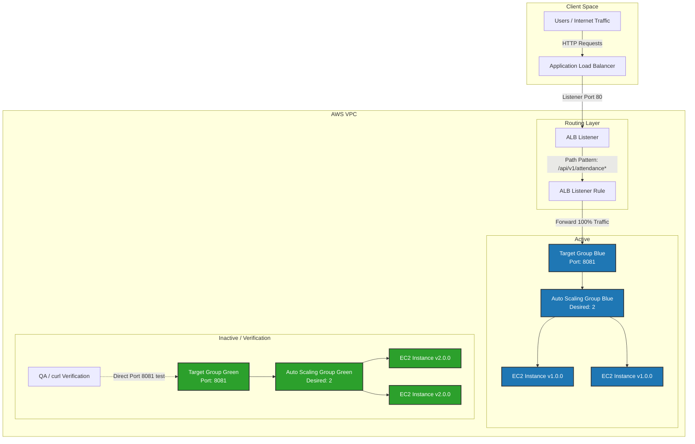
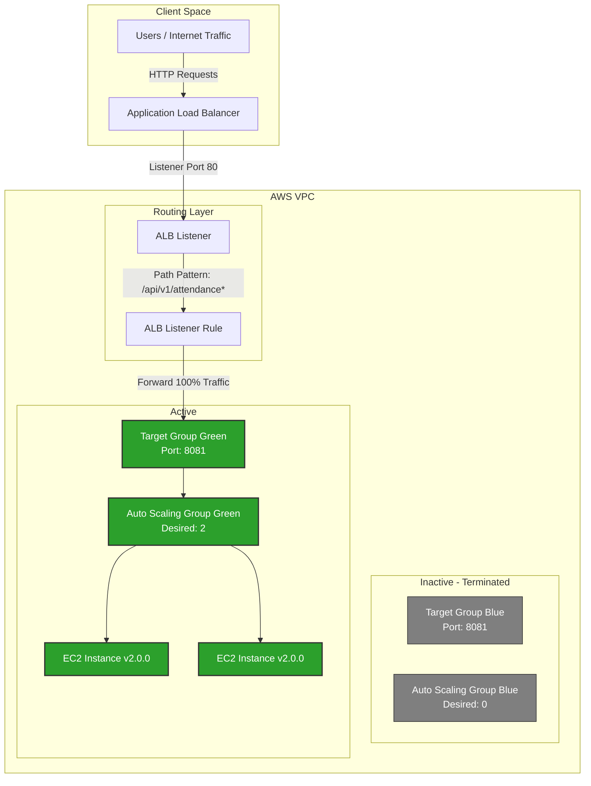

# POC – Continuous Delivery via Blue-Green Deployment (Manual & TF Strategy)

---

## Author Information

| Author | Created | Version | Last Updated By | Last Edited On | L0 Reviewer | L1 Reviewer | L2 Reviewer |
|---|---|---|---|---|---|---|---|
| Bhawna Dangarh | 2026-08-09 | 1.5 | Bhawna Dangarh | 2026-08-13 | Sharvari Khamkar / Tina Bhatnagar | Aman Raj | Abhishek Dubey |

---

## Table of Contents

1. [Introduction](#1-introduction)
2. [Objective](#2-objective)
3. [Blue-Green Architecture & Traffic Flow](#3-blue-green-architecture--traffic-flow)
4. [Blue-Green Infrastructure Flowchart](#4-blue-green-infrastructure-flowchart)
5. [Step-by-Step Manual Rollout via AWS Console](#5-step-by-step-manual-rollout-via-aws-console)  
   5.1 [Stage 1: Provision Initial Active Environment (Blue Only)](#51-stage-1-provision-initial-active-environment-blue-only)  
   5.2 [Stage 2: Introduce and Provision the Green Environment](#52-stage-2-introduce-and-provision-the-green-environment)  
   5.3 [Stage 3: Health Status Check Verification](#53-stage-3-health-status-check-verification)  
   5.4 [Stage 4: Shift Traffic to Green (Update ALB Listener Rule)](#54-stage-4-shift-traffic-to-green-update-alb-listener-rule)  
   5.5 [Stage 5: Scale Down Blue Environment](#55-stage-5-scale-down-blue-environment)  
6. [Achieving the Strategy via Terraform (Conceptual Overview)](#6-achieving-the-strategy-via-terraform-conceptual-overview)
7. [Commands Used for Verification](#7-commands-used-for-verification)
8. [Troubleshooting](#8-troubleshooting)
9. [Contact Information](#9-contact-information)
10. [References](#10-references)

---

## 1. Introduction

Continuous Delivery (CD) is used to deploy application releases automatically, safely, and reliably. Rather than updating live EC2 instances in-place (Mutable Infrastructure)—which risks configuration drift and downtime—we employ **Blue-Green Deployment** (Immutable Infrastructure). 

In this setup, we maintain two identical production-ready environments:
- **Blue**: Represents the current active production environment.
- **Green**: Represents the inactive environment where the new version is deployed and verified before shifting traffic.

If an issue occurs, rollback is instantaneous, achieved by pointing the load balancer rule back to the healthy Blue environment.

---

## 2. Objective

- Automate zero-downtime application deployments.
- Re-use network infrastructure (VPC, ALB, Subnets) and build target groups, Auto Scaling Groups (ASGs), and ALB routing rules.
- Demonstrate a complete rollout and traffic switch step-by-step using both AWS Console (Manual) and Terraform concepts.
- Configure health checks to guarantee that unhealthy application versions do not receive user traffic.
- Reduce resource costs by scaling down the inactive environment's capacity to zero after a successful rollout.

---

## 3. Blue-Green Architecture & Traffic Flow

The following diagrams illustrate the AWS resource configuration and how traffic is shifted during a rollout:

### Phase 1: Deploy & Verify (Blue Environment Active, Green Deploying)
* **Blue ASG** is active and serving 100% of production traffic through the **Blue Target Group**.
* **Green ASG** is scaled up with the new version and registered with the **Green Target Group** for health check verification and testing.

### Phase 2: Traffic Shift & Clean-up (Green Environment Active, Blue Scaled Down)
* The **ALB Listener Rule** is updated to point to the **Green Target Group**, routing 100% of production traffic to the new version.
* Once the Green environment is verified as stable in production, the **Blue ASG** is scaled down to `0` capacity to release resources.

---

## 4. Blue-Green Infrastructure Flowchart

The flowchart below demonstrates the rollout steps and rollback checkpoints implemented in this POC:

---

## 5. Step-by-Step Manual Rollout via AWS Console

The following details the sequential lifecycle of resources when executing a Blue-Green deployment manually using the AWS Management Console:

### 5.1 Stage 1: Provision Initial Active Environment (Blue Only)
At the start, only the Blue environment resources are provisioned. The Application Load Balancer routes 100% of production traffic to this environment.

1. **Create Blue Target Group**:
   - Navigate to the **EC2 Console** -> **Target Groups** -> **Create Target Group**.
   - Target type: `Instances`. Name: `tg-otms-attendance-blue`. Port: `8081`. Protocol: `HTTP`.
   - Configure Health Checks: Path `/api/v1/attendance/health`, Protocol `HTTP`, Port `8081`.
2. **Create Launch Template**:
   - Go to **EC2** -> **Launch Templates** -> **Create Launch Template**.
   - Specify AMI ID (containing version `v1.0.0`), instance type (`t2.micro`), and Key Pair.
   - Configure Security Group (`dev-otms-attendance-sg`) to allow incoming traffic on port 8081.
3. **Create Blue Auto Scaling Group (ASG)**:
   - Go to **EC2** -> **Auto Scaling Groups** -> **Create Auto Scaling Group**.
   - Link the Blue Launch Template. Choose VPC and private backend subnets.
   - Under **Load Balancing**, select "Attach to an existing load balancer" and choose Target Group `tg-otms-attendance-blue`.
   - Set size: Desired = `2`, Min = `2`, Max = `5`.
4. **Configure ALB Listener Rule**:
   - Navigate to **EC2** -> **Load Balancers** -> Select your ALB (`dev-otms-alb`).
   - Go to the **Listeners and Rules** tab -> Select HTTP:80 Listener -> **Manage Rules** -> **Add Rule**.
   - Set condition: Path is `/api/v1/attendance*`.
   - Set action: Forward to Target Group `tg-otms-attendance-blue`. Priority: `20`.

Live users are now hitting the Blue target instances running version `v1.0.0`.

---

### 5.2 Stage 2: Introduce and Provision the Green Environment
When version `v2.0.0` is ready for release, we deploy it to the Green environment.

> [!IMPORTANT]
> At this stage, **do NOT edit the ALB Listener Rule**. The rule must remain pointing to `tg-otms-attendance-blue` so that production traffic is unaffected.

1. **Create Green Target Group**:
   - Go to **Target Groups** -> **Create Target Group**.
   - Target type: `Instances`. Name: `tg-otms-attendance-green`. Port: `8081`. Protocol: `HTTP`.
   - Set the same health check path: `/api/v1/attendance/health` on Port `8081`.
2. **Update Launch Template (Create New Version)**:
   - Go to **Launch Templates** -> Select your template -> **Modify Template (Create New Version)**.
   - Update the AMI ID to refer to the new image containing version `v2.0.0`.
3. **Create Green Auto Scaling Group (ASG)**:
   - Go to **Auto Scaling Groups** -> **Create Auto Scaling Group**.
   - Link the Launch Template and specify the new template version containing `v2.0.0`.
   - Under **Load Balancing**, choose Target Group `tg-otms-attendance-green`.
   - Set size: Desired = `2`, Min = `2`, Max = `5`.

Green instances are launched and automatically register themselves with `tg-otms-attendance-green`.

---

### 5.3 Stage 3: Health Status Check Verification
Before shifting production traffic, we verify that the Green instances are healthy:

1. Navigate to **EC2 Console** -> **Target Groups** -> Select `tg-otms-attendance-green`.
2. Under the **Targets** tab, view the status of the registered targets.
3. Wait until the health status changes from `initial` to **`healthy`**.

* **If healthy**: Proceed to Stage 4.
* **If unhealthy**: Stop the deployment. Rollback immediately by deleting/scaling down the Green ASG `asg-otms-attendance-green` size to `0` and investigate logs.

---

### 5.4 Stage 4: Shift Traffic to Green (Update ALB Listener Rule)
Once the Green targets are confirmed healthy, we redirect client traffic:

1. Navigate to **EC2** -> **Load Balancers** -> Select your ALB.
2. Go to **Listeners and Rules** -> Select the HTTP:80 listener -> View/Edit rules.
3. Select the rule with path `/api/v1/attendance*` and click **Edit**.
4. In the **Actions** section, change the target group from `tg-otms-attendance-blue` to **`tg-otms-attendance-green`**.
5. Save the rule.

The ALB immediately switches all routing to the Green Target Group, redirecting 100% of user traffic to version `v2.0.0`.

---

### 5.5 Stage 5: Scale Down Blue Environment
After monitoring the Green environment stability under production load for a designated window, scale down the old Blue environment to release resources:

1. Go to **EC2** -> **Auto Scaling Groups** -> Select `asg-otms-attendance-blue`.
2. Under the **Details** tab, click **Edit** on group details.
3. Update group sizes: Desired = `0`, Min = `0`, Max = `5` (or `0`).
4. Save the configuration.

AWS will terminate all instances in the Blue ASG. The rollout is complete.

---

## 6. Achieving the Strategy via Terraform (Conceptual Overview)

Instead of manually clicking through the AWS Console, the same infrastructure dependencies and rollout steps can be declared as IaC in Terraform.

### Core Terraform Resources Used:
- **`aws_lb_target_group`**: Declares target groups for both environments (`tg_blue` and `tg_green`).
- **`aws_launch_template`**: Declares configurations like AMI ID and instance sizes for both versions.
- **`aws_autoscaling_group`**: Declares ASGs for both environments (`asg_blue` and `asg_green`), linking them to their respective target groups and launch templates.
- **`aws_lb_listener_rule`**: Statically defines routing rules for the path pattern.
- **`data` blocks**: Used to query existing shared network resources (e.g. `data "aws_lb"`, `data "aws_lb_listener"`, `data "aws_vpc"`).

### How Rollout is Performed via TF:
1. **Initial state**: `aws_lb_listener_rule` has `target_group_arn = aws_lb_target_group.tg_blue.arn` and `asg_blue` has desired capacity = 2.
2. **Provision Green**: Declare `tg_green` and `asg_green` in `main.tf` with capacity = 2. Run `terraform apply`.
3. **Shift Traffic**: Edit the listener rule in `main.tf` to point to Green: `target_group_arn = aws_lb_target_group.tg_green.arn`. Run `terraform apply`.
4. **Decommission Blue**: Change `blue_desired_capacity` variable or parameter in file to `0`. Run `terraform apply`.

---

## 7. Commands Used for Verification

| Command | Description |
| --- | --- |
| `curl -I http://<ALB-DNS-URL>/api/v1/attendance/health` | Validates API HTTP status responses. |
| `aws elbv2 describe-target-health --target-group-arn <TG-ARN>` | Queries Target Group health status from CLI. |

---

## 8. Troubleshooting

| Issue | Cause | Solution |
| --- | --- | --- |
| **New instances fail ALB Health Checks** | Application is not running on port 8081, or security group blocks traffic. | Verify Instance User Data logs (`/var/log/cloud-init-output.log`). Ensure Security Group allows incoming port 8081 from the ALB. |
| **ALB Listener Rule Priorities Conflict** | A rule with priority `20` already exists on the listener. | Choose a unique listener rule priority when configuring the rule. |

---

## 9. Contact Information

| Name | Email |
|------|-------|
| Bhawna Dangarh | [bhawna.dangarh.snaatak@mygurukulam.co](mailto:bhawna.dangarh.snaatak@mygurukulam.co) |

---

## 10. References

| Description | Link |
|------------|------|
| AWS Application Load Balancer Target Group | [https://docs.aws.amazon.com/elasticloadbalancing/latest/application/load-balancer-target-groups.html](https://docs.aws.amazon.com/elasticloadbalancing/latest/application/load-balancer-target-groups.html) |
| Blue-Green Deployments on AWS | [https://docs.aws.amazon.com/whitepapers/latest/blue-green-deployments/introduction.html](https://docs.aws.amazon.com/whitepapers/latest/blue-green-deployments/introduction.html) |
